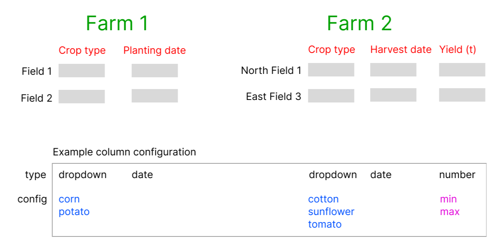

# Welcome to the Regrow FE coding challenge!

## Your task

Design and Build a reusable Table component, where a _farmer_ can enter information about their _fields_.

### Please follow the steps below to complete the coding challenge:

- Refer to the reference.jpg as a guide
- Each column in the Table will have an input type, e.g. dropdown, date-picker or text input
- The Table should be usable in various situations, e.g. during planting or harvest season
- Render the Table component with some mock data

---

If you have time:

- Build some input components for the Table
- Build the column reordering UI
