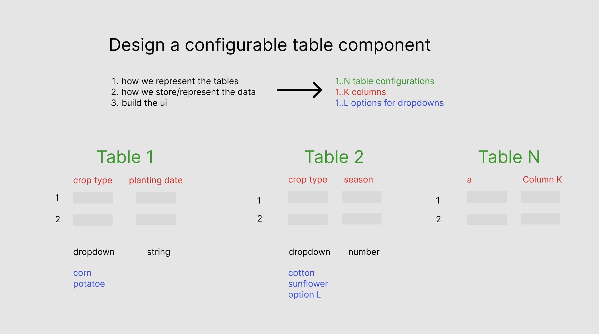

# configurable-table

## Prerequisites:

- node v18

## Task:

Design the Table component that displays the columns based on the config.

1. How we represent the tables?
2. How we represent the data?
3. Build the UI to show the data.
4. (Bonus) Build the column reordering UI.

